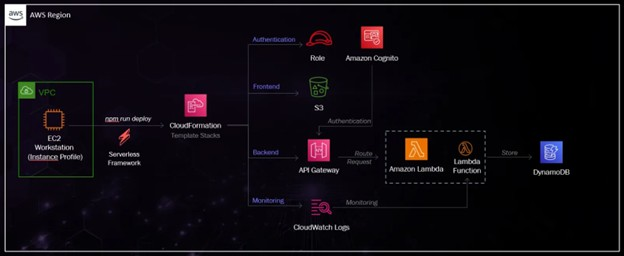

# Healthhub-A-Serverless-Intelligent-and-AI-Integrated-Solution-for-Healthcare-System
This project demonstrates the deployment of a 100% serverless application on AWS, leveraging key AWS services to create a scalable and efficient architecture

# HealthHub - Serverless Healthcare Solution

## Overview
HealthHub is a 100% serverless, intelligent, and AI-integrated healthcare solution designed to streamline patient-doctor interactions, appointment scheduling, and secure data management. Built on AWS services, HealthHub leverages modern cloud-native architecture for scalability, security, and cost-efficiency.

## Architecture


### AWS Services Used
- **Amazon Cognito**: Authentication and user management.
- **Amazon API Gateway**: Routing API requests.
- **AWS Lambda**: Serverless compute for backend logic.
- **Amazon DynamoDB**: NoSQL database for storing healthcare data.
- **Amazon S3**: Static asset hosting for frontend.
- **AWS CloudWatch**: Monitoring and logging.
- **AWS IAM**: Role-based access control.

## Features
- 100% Serverless Architecture.
- AI-ready integration for healthcare insights.
- Secure authentication and authorization.
- Scalable backend services using AWS Lambda.
- Modern frontend powered by Vite.

## Prerequisites
- AWS Account with required permissions.
- IAM Role: `tcb-hh-role` with `AdministratorAccess`.
- EC2 Workstation (Amazon Linux 2023 AMI, t2.medium, 30GiB storage).
- Installed tools:
  - AWS CLI
  - Node.js (via NVM)
  - Serverless Framework CLI

## Deployment Steps
### 1. Backend Setup
```bash
wget https://tcb-bootcamps.s3.us-east-1.amazonaws.com/aicloud-bootcamp/v1/module3/healthhub-module-3.zip
unzip healthhub-module-3.zip
cd healthhub-module-3/health-hub-backend
npm install
for service in src/services/*; do (cd "$service" && npm install); done
npm run deploy
```

### 2. Frontend Setup
```bash
cd ../health-hub-frontend
npm install
cp .env.example .env
# API Gateway URL will be auto-configured by deployment script
```

### 3. Run Application
```bash
npm run dev -- --host
```
Access via: `http://<EC2_PUBLIC_IP>:5173`

## Usage
- Login as Doctor or Patient.
- Add doctor and patient profiles.
- Schedule and manage appointments.

## Validation & Troubleshooting
- Check AWS CloudFormation for stack status.
- Review logs in AWS CloudWatch.
- Redeploy individual services if needed:
```bash
serverless deploy --stage dev --service SERVICE-NAME
```

## Evidence
Capture screenshots of Doctor Dashboard showing scheduled appointments.
